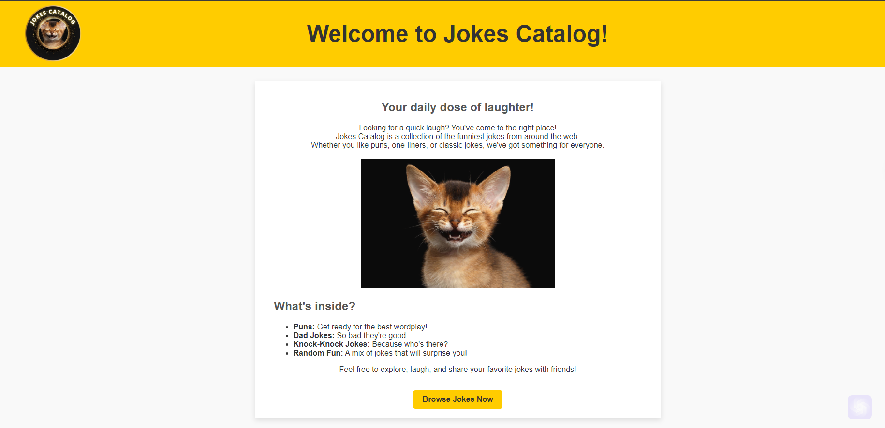

<div align="center">
<br>



</div>


<p align="center">


</p>


<h1 align="center"> Jokes Catalog </h1>


<h3 align="center">
<a href="https://github.com/RazikaBengana/Jokes_catalog/tree/main/#eye-about">About</a> •
<a href="https://github.com/RazikaBengana/Jokes_catalog/tree/main/#memo-learning-objectives">Learning Objectives</a> •
<a href="https://github.com/RazikaBengana/Jokes_catalog/tree/main/#computer-requirements">Requirements</a> •
<a href="https://github.com/RazikaBengana/Jokes_catalog/tree/main/#package-installation">Installation</a> •
<a href="https://github.com/RazikaBengana/Jokes_catalog/tree/main/#keyboard-basic-usage">Basic usage</a> •
<a href="https://github.com/RazikaBengana/Jokes_catalog/tree/main/#pushpin-more info">More info</a> •
<a href="https://github.com/RazikaBengana/Jokes_catalog/tree/main/#bust_in_silhouette-authors">Authors</a> •
<a href="https://github.com/RazikaBengana/Jokes_catalog/tree/main/#octocat-license">License</a>
</h3>

---

<!-- ------------------------------------------------------------------------------------------------- -->

<br>
<br>

## :eye: About

<br>

<div align="center">

**`Jokes Catalog`** is a `Ruby on Rails` application that implements a joke catalog with `CRUD` functionality using RESTful conventions: `GET` for viewing, `POST` for creating, `PUT` for updating, and `DELETE` for removing jokes.
<br>
The app includes pages for listing all jokes, viewing individual jokes, creating new jokes, editing existing jokes, and a home page, all following the `MVC` architecture.

</div>

<br>
<br>

<!-- ------------------------------------------------------------------------------------------------- -->

## :memo: Learning objectives

<br>

```diff

+ Implement a Ruby on Rails application following MVC architecture

+ Create RESTful routes for handling GET, POST, PUT, and DELETE requests

+ Develop CRUD functionality for managing database records

+ Build a user-friendly web interface for interacting with data

```

<br>
<br>

<!-- ------------------------------------------------------------------------------------------------- -->

## :computer: Requirements

<br>

```diff

+ Ruby 3.2.0

+ Rails 7.0.4

+ PostgreSQL

```

<br>
<br>

<!-- ------------------------------------------------------------------------------------------------- -->

## :package: Installation

<br>

- Clone the repository

<br>

- Install dependencies:

<br>

```yaml
bundle install
```

<br>

- Set up the database:

    - Ensure `PostgreSQL` is installed and running
    - Configure database settings in `config/database.yml` if necessary (`username` & `password`)

<br>

```yaml
rails db:create
rails db:migrate
rails db:seed
```

<br>
<br>

<!-- ------------------------------------------------------------------------------------------------- -->

## :keyboard: Basic Usage

<br>

- Start the `Rails` server:

<br>

```yaml
rails server
```

<br>

- Visit [http://localhost:3000](http://localhost:3000) in your web browser

<br>

- Use the web interface to **create**, **view**, **update**, and **delete** jokes.


<br>
<br>

<!-- ------------------------------------------------------------------------------------------------- -->

## :pushpin: More Info

<br>

### Services

<br>

- No external services are required for this application.

<br>
<br>

### Deployment Instructions

<br>

- This application can be deployed to platforms like `Heroku` or any other Rails-compatible hosting service.

<br>

- Ensure environment variables are properly set for the production environment.

<br>
<br>

<!-- ------------------------------------------------------------------------------------------------- -->

## :bust_in_silhouette: Authors

<br>

**${\color{blue}Razika \space Bengana}$**

<br>
<br>

<!-- ------------------------------------------------------------------------------------------------- -->

## :octocat: License

<br>

```Jokes Catalog``` _project has no license specified._

<br>
<br>

---

<p align="center"><br>2024</p>